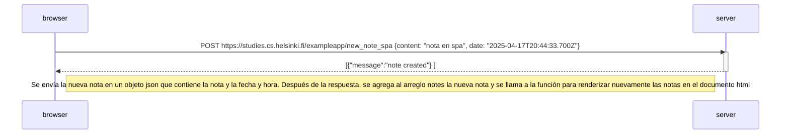

```mermaid
sequenceDiagram
    participant browser
    participant server

    browser->>server: POST https://studies.cs.helsinki.fi/exampleapp/new_note_spa {content: "nota en spa", date: "2025-04-17T20:44:33.700Z"}
    activate server
    server-->>browser: [{"message":"note created"} ]
    deactivate server
    
    Note right of browser: Se envía la nueva nota en un objeto json que contiene la nota y la fecha y hora. Después de la respuesta, se agrega al arreglo notes la nueva nota y se llama a la función para renderizar nuevamente las notas en el documento html
```